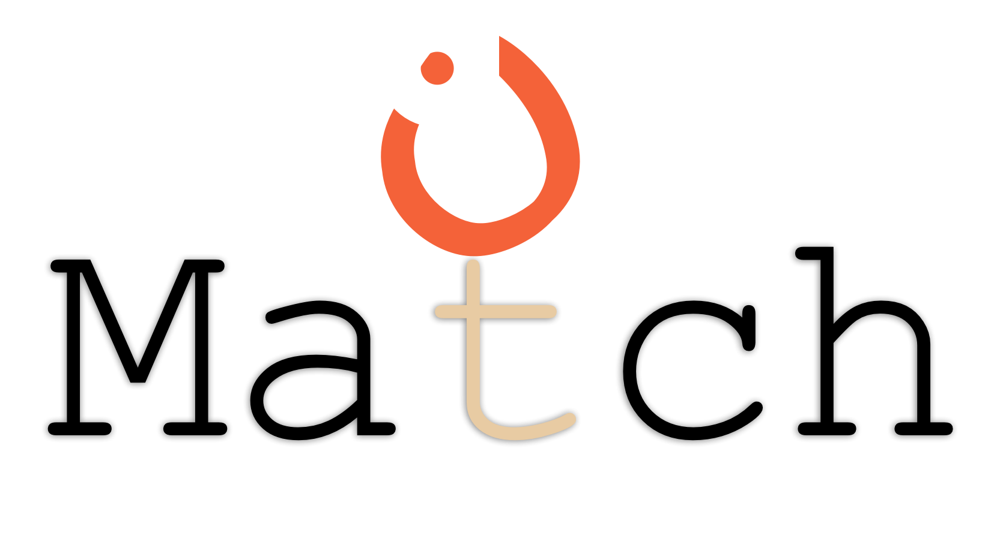
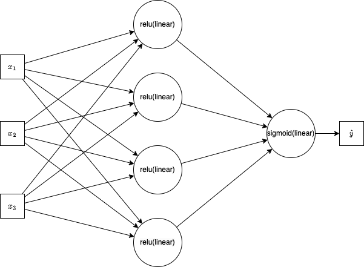
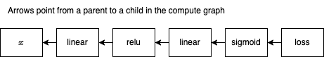

<div align="center">

<picture>
  <source media="(prefers-color-scheme: dark)" srcset="images/MatchLogoDark.png">
  <source media="(prefers-color-scheme: light)" srcset="images/MatchLogoLight.png">
  
</picture>
<p>
A simple, PyTorch-like automatic differentiation library for education.
</p>

</div>

# Quick Start

```bash
# Create a new virtual environment
mamba create --name match python
conda activate match

# Clone the repository
cd path/to/your/projects
git clone https://github.com/pymatch/pymatch
cd pymatch

# Install the library
python -m pip install --editable .

# TODO: run simple script? (demos and unit tests have external dependencies)
```

# File Structure

```text
 ./                         #
├──  examples/              #
│  └──  linear_model.ipynb  #
├──  src/                   #
│  └──  match/              # The Match library source code
│     ├──  __init__.py      # -- default library import statements
│     ├──  nn.py            # -- higher-level neural network functionality
│     ├──  tensor.py        # -- an automatic differentiation tensor class
│     ├──  tensordata.py    # -- a storage class for tensor data
│     └──  util.py          # -- utility functions
├──  tests/                 #
│  ├──  __init__.py         #
│  └──  test_tensordata.py  #
├──  pyproject.toml         #
├──  LICENSE                #
└──  README.md              #
```

# Demos

Although **Match** does not have any dependencies, the demos do. Demos import [matplotlib](https://matplotlib.org/), but you can skip (or comment) plotting cells (code) and not miss out on much. Demos come in two flavors: Jupyter Notebooks and Python scripts. These files are synced using [Jupytext](https://jupytext.readthedocs.io/en/latest/).

https://user-images.githubusercontent.com/4173647/154419094-5787e3a5-0e69-4d89-9ed7-e3ee507f1f32.mp4

# Implementation of Automatic Differentiation

The library uses implements [reverse-mode automatic differentiation](https://en.wikipedia.org/wiki/Automatic_differentiation#Reverse_accumulation). Here are highlights of the implementation:

- `list2d.py` contains an implementation of several matrix operations (e.g., element-wise arithmetic, matrix multiplication, etc.)
- `matrix.py` relies on `list2d.py` and adds automatic differentiation functionality (it was important to decouple the underlying matrix operations in `list2d.py` from the usage of `Matrix` objects; this made it easier to include matrix operations in the gradient functions without running into a recursive loop)
- `nn.py` adds common neural network functionality on top of `matrix.py`

## Single "`_`" Convention

You'll see some methods with a trailing `_` in the name. This denotes that the method will mutate the current object. For example,

```python
class List2D(object):

    ...

    def ones_(self) -> None:
        """Modify all values in the matrix to be 1.0."""
        self.__set(1.0)

    ...

    def relu(self) -> List2D:
        """Return a new List2D object with the ReLU of each element."""
        vals = [
            [max(0.0, self.vals[i][j]) for j in range(self.ncol)]
            for i in range(self.nrow)
        ]
        return List2D(*self.shape, vals)

    ...
```

The `ones_` method sets all values of the current `List2D` to `1.0` whereas the `relu` method returns a new `List2D` object where each value is computed using `relu` function.

## Double "`__`" Convention

Some method names start with two `_`. These are *internal* functions that should not be used outside of the class. For example,

```python
class List2D(object):

    ...

    def __set(self, val) -> None:
        """Internal method to set all values in the matrix to val."""
        self.vals = [[val] * self.ncol for _ in range(self.nrow)]

    ...
```

You'll also find many double `_` methods. These are known as Python magic or "dunder" (double underscore) methods. They make it easy to implement things like addition and subtraction with a custom object. For example,

```python
class List2D(object):

    ...

    def __add__(self, rhs: float | int | List2D) -> List2D:
        """Element-wise addition: self + rhs."""
        return self.__binary_op(add, rhs)

    ...

a = List2D(...)
b = List2D(...)
c = a + b # <-- uses the __add__ method with self=a and rhs=b
```

## Compute Graphs

Consider the following model:

```python
class MatchNetwork(match.nn.Module):
    def __init__(self, n0, n1, n2) -> None:
        super().__init__()
        self.linear1 = match.nn.Linear(n0, n1)
        self.relu = match.nn.ReLU()
        self.linear2 = match.nn.Linear(n1, n2)
        self.sigmoid = match.nn.Sigmoid()

    def forward(self, x) -> Matrix:
        x = self.linear1(x)
        x = self.relu(x)
        x = self.linear2(x)
        x = self.sigmoid(x) # <-- this line of code is referenced below
        return x
```

What happens we we create a `MatchNetwork` and then compute an output?

```python
num_features = 3
num_outputs = 1
model = MatchNetwork(n0=num_features, n1=4, n2=num_outputs)

x = ... # Some input example
y = ... # Some matching output label

yhat = model(x) # <-- invokes the forward pass
```

We can represent the forward pass using math, or more readably with the following graph:

<div align="center"> <picture>  </picture> </div>

Although the figure above is useful, it is more useful (here) to think about the compute graph. But first, let's see the code needed to create the compute graph. Consider match's implementation of a *sigmoid*.

```python
# Sigmoid object from nn.py
class Sigmoid(Module):
    """Sigmoid(x) = 1 / (1 + e^(-x))"""

    def forward(self, x: Matrix) -> Matrix:
        # Returns a new Matrix
        return x.sigmoid()

# Sigmoid compute node from matrix.py
def sigmoid(self) -> Matrix:
    """Element-wise sigmoid."""
    result = Matrix(self.data.sigmoid(), children=(self,))

    def _gradient() -> None:
        self.grad += result.data * (1 - result.data) * result.grad

    result._gradient = _gradient
    return result

# Sigmoid math from list2d.py
def sigmoid(self) -> List2D:
    """Return a new List2D object with the sigmoid of each element."""
    vals = [
        [sigmoid(self.vals[i][j]) for j in range(self.ncol)]
        for i in range(self.nrow)
    ]
    return List2D(*self.shape, vals)

```

The following occurs when `sigmoid(x)` is called inside our model's `forward` method:

1. We call `x.sigmoid` where `x` is the output of the previous linear node.
2. A new `Matrix` object (called `result`) is constructed
    + Elements in `result` are computed by taking the `sigmoid` of each value in the linear output
    + The the linear output becomes a child of `result` in the compute graph
    + The new matrix is the same shape as the linear output
3. A gradient [closure](https://en.wikipedia.org/wiki/Closure_(computer_programming)) (called `_gradient`) is created with the correct computations for future use
    + The closure is attached to the `result` compute node
    + The closure has access to the values and gradient of the linear output
    + The **closure updates the gradient of the linear node (not itself)**

Notice that we cannot compute the gradient of `self` until we have the gradient of `result`, which is not computed until its parents are computed. Here's the compute graph:

<div align="center"> <picture>  </picture> </div>

We now have a compute graph (it includes a reference to `loss`, which is given below). It was generated by the `forward` method of `MatchNetwork`, which was automatically called. Each method call in `forward` (`self.linear1`, etc.) builds up the graph. Now that we have the graph, we can compute an optimization function and update all model parameters.

```python
loss = loss_fcn(yhat, y) # Any loss function will do
net.zero_grad()          # Clear previous gradients (no-op first iteration)
loss.backward()          # All gradients are computed
```

Finally, we just need to update parameter values.

```python
for param in net.parameters():
    # param.grad was computed during the loss.backward() call above
    param.data = param.data - learning_rate * param.grad
```

See [5.2 Backpropagation](https://singlepages.github.io/NeuralNetworks/#neural-networks-and-backpropagation) for more information.

# Adding Functionality

To give you an idea of how to add some new functionality, let's trace through the process I used to add the mean-square-error loss function (`MSELoss`).

1. Create a new class inside `nn.py`: `class MSELoss(Module)`
    + The class must extend the `Module` class
    + Implement the `forward` method for the new class
        + It can take any arguments that fit your needs
        + It should return a `Matrix`
        + Most arguments will be a `Matrix` (matrix in and matrix out, hence "forward")
        + For `MSELoss` we return `((target - prediction) ** 2).mean()`
2. Add necessary matrix operations to the `Matrix` class in `matrix.py`. For MSE, we need
    + Subtraction for `(target - prediction)` (implemented by defining the `__sub__` method)
    + Exponentiation for `_ ** 2` (implemented by defining the `__pow__` method)
    + Mean for `_.mean()` (implemented by defining the `mean` method)
    + You might also need to implement operators for the gradient computations (e.g., `>` for ReLU)
    + (note that each of these new methods must build up the compute graph)
3. Add necessary math to the `List2D` class in `list2d.py`. For MSE, we need
    + (note that the `Matrix` class doesn't actually implement any math, just compute graph creation)
    + Subtraction is implemented by defining the `__sub__` method
    + Exponentiation is implemented by defining the `__pow__` method
    + Mean is implemented by defining the `mean` method
    + (you may need to import new libraries or library functionality)

To recap:

1. Create a new `Module`
2. Add new functionality to `Matrix` for creating the compute graph
3. Add new functionality to `List2D` for computing the matrix math

# Testing

The library has a limited number of tests found in the file `tests` directory. Match unit tests require the PyTorch library. and you can run them with:

```bash
# Run this command from the root of the repository
python -m unittest
```

# Resources

- [Build Your own Deep Learning Framework - A Hands-on Introduction to Automatic Differentiation - Part 2](https://mostafa-samir.github.io/auto-diff-pt2/ "Build Your own Deep Learning Framework - A Hands-on Introduction to Automatic Differentiation - Part 2")
- [How we wrote xtensor 1/N: N-Dimensional Containers | by Johan Mabille](https://johan-mabille.medium.com/how-we-wrote-xtensor-1-n-n-dimensional-containers-f79f9f4966a7 "How we wrote xtensor 1/N: N-Dimensional Containers | by Johan Mabille")
- [Chain Rule on Matrix Multiplication](https://github.com/Mostafa-Samir/Hands-on-Intro-to-Auto-Diff/blob/master/Chain-Rule-on-Matrix-Multiplication.pdf "Hands-on-Intro-to-Auto-Diff/Chain-Rule-on-Matrix-Multiplication.pdf at master · Mostafa-Samir/Hands-on-Intro-to-Auto-Diff")
- [A tiny scalar-valued autograd engine and a neural net library on top of it with PyTorch-like API](https://github.com/karpathy/micrograd "karpathy/micrograd: A tiny scalar-valued autograd engine and a neural net library on top of it with PyTorch-like API")
- [The magic behind autodiff | Tutorials on automatic differentiation and JAX](https://sscardapane.github.io/learn-autodiff/ "The magic behind autodiff | Tutorials on automatic differentiation and JAX")
- [Google Colab: Coding a neural net](https://colab.research.google.com/drive/1HS3qbHArkqFlImT2KnF5pcMCz7ueHNvY?usp=sharing#scrollTo=RWqEaOWqNbwV)
- [Example matrix gradients](https://github.com/Mostafa-Samir/Hands-on-Intro-to-Auto-Diff/blob/master/autodiff/grads.py)
- [Differentiable Programming from Scratch – Max Slater – Computer Graphics, Programming, and Math](https://thenumb.at/Autodiff/)

# Plans

- create multi-dimensional data class based on a one-dimension list
- change matrix to tensor
- add functionality for
    + Adam
    + proper initialization
    + data wrangling (datasets and loaders?)
    + dropout
    + batch norm
    + CNNs (pooling)
    + RNNs
    + transformers
- add demos for
    + ResNets
    + GPT (2 or 3?)
    + stable diffusion?
    + GANs?
